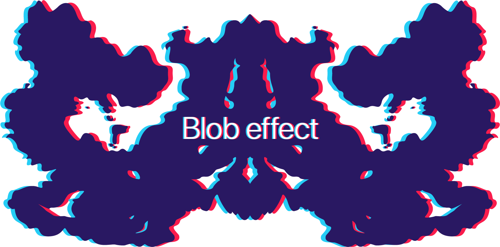
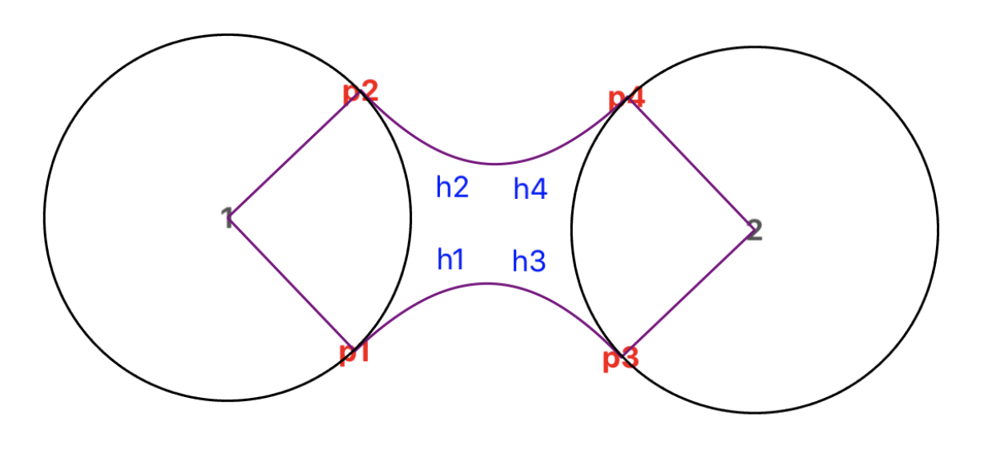

# Blob effect in iOS

  

The project demonstrates implementation of a 2D blob effect (or [metaballs](https://en.wikipedia.org/wiki/Metaballs)) written using UIKit.
Project contains example setup and separated `MetaballsView` with the implementation of an effect.

## Overview

Mostly inspired by [these](http://paperjs.org/examples/meta-balls/) [two](https://varun.ca/metaballs/) articles I implemented the effect utilizing Bezier curves with the help of UIKit. During the R&D process, I tried a couple of approaches (like building pixel-by-pixel, [marching squares](http://jamie-wong.com/2014/08/19/metaballs-and-marching-squares/) and some more), but due to the nature of the rendering process on a mobile platform selected one is the most efficient. Each time a user move a ball (changes its position), the host view recalculates curves for each pair of balls.

## Implementation details

There's a host view class `MetaballsView` which is responsible for building, configuring and interaction.

It holds a list of interactable `UIView`s (yep, it holds it twice due to the hierarchy, but in that case, it doesn't create any retain issues).

`blobLayers` is a two-dimensional array of `CAShapeLayer`s that used to display blob connection between balls. To be able to directly access layer between i-th and j-th balls, the array is made two-dimensional so it could be accessed like `blobLayers[i][j]`. Due to mirroring, `blobLayers[j][i]` should be drawn the same as `blobLayers[i][j]`, but I haven't optimized it yet, just ignoring the path.

The `Blob` entity calculates and holds information regarding tangent points and handle curves points.

The `Metaball` entity holds actual ball information and utilizes `Blob` to build a path with another `Metaball` and translate it into `UIBezierPath`. Basically, these two classes could be used to implement the same effect independently from UIKit.

The following image demonstrates the principle behind math.

There're two bezier curves: from point `p1` to `p3` with control points in `h1` and `h3`, and inversed one from points `p2` to `p4` through `h2`, `h4`. Refer to [debugging](https://github.com/rnkyr/metaballs/tree/debugging-bezier) branch to view details.

For pixel-by-pixel implementation refer to [this](https://github.com/rnkyr/metaballs/tree/point-by-point) branch.
